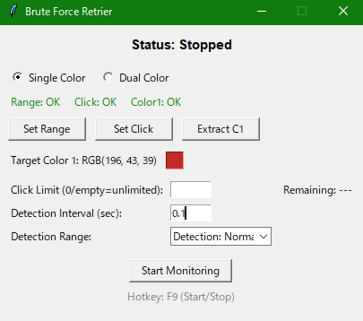

# Cline Retry Auto Clicker

指定した画面範囲内の特定の色を監視し、その色を検出したら指定した地点をクリックするシンプルな自動クリッカーです。
A simple auto clicker that monitors a specified screen area for a specific color and clicks a designated point when the color is detected.



## 作成理由

VSCode 拡張機能である Cline を使用中、"API request failed" というエラーメッセージと共に表示される "Retry" ボタンを頻繁に手動でクリックする必要がありました。この繰り返し作業を自動化するために、このツールを作成しました。特定の領域に指定した色（"Retry" ボタンの色）が現れたら自動でクリックすることで、作業効率の向上を目指しています。

## Why This Was Created

While using the Cline VSCode extension, I frequently encountered the "API request failed" error message, requiring manual clicks on the accompanying "Retry" button. To automate this repetitive task, I created this tool. It aims to improve workflow efficiency by automatically clicking a designated spot when a specific color (the color of the "Retry" button) appears in a monitored area.

## Table of Contents / 目次

*   [日本語 (Japanese)](#日本語-japanese)
    *   [機能](#機能-jp)
    *   [使い方](#使い方-jp)
    *   [注意事項](#注意事項-jp)
    *   [開発環境 (参考)](#開発環境-参考-jp)
    *   [バグ報告・連絡先](#バグ報告連絡先-jp)
*   [English (英語)](#english-英語)
    *   [Features](#features-en)
    *   [How to Use](#how-to-use-en)
    *   [Notes](#notes-en)
    *   [Development Environment (Reference)](#development-environment-reference-en)
    *   [Bug Reports / Contact](#bug-reports--contact-en)

---

## 日本語 (Japanese) <a name="日本語-japanese"></a>

### 機能 <a name="機能-jp"></a>

*   **判定モード**:
    *   **単色判定**: 1つのターゲット色を監視します。
    *   **2色判定**: 2つの異なるターゲット色を監視します。
*   **色検出**: 画面上の指定範囲を監視し、選択したモードに応じて設定したターゲット色（単色モードなら色1、2色モードなら色1または色2）を検出します。
*   **自動クリック**: ターゲット色を検出（1回目）すると、設定された「判定間隔」秒数待機します。その後再度**同じ色**を検出し（2回目）、連続検出に成功するとステータスが「クリック実行」に変わり、1秒後に設定した地点を自動でクリックします。（2色モードの場合、どちらかの色が連続検出されればクリックが実行されます。）
*   **クリック上限**: 指定した回数クリックしたら自動で停止します（0または空欄で無制限）。
*   **判定間隔**: 色を1回目に検出してから、2回目の検出を行うまでの待機時間（秒）を設定できます。
*   **判定範囲（感度）**: 色検出の許容誤差を5段階（広い～狭い）で調整できます。「広い」ほど似た色でも検出しやすくなります。
*   **ホットキー**: F9キーで監視の開始/停止を切り替えられます。
*   **設定**:
    *   **範囲設定**: 監視する画面範囲をドラッグして指定します。
    *   **クリック設定**: クリックする画面上の地点を指定します。
    *   **色1/色2 抽出**: 画面上のピクセルをクリックしてターゲット色1または色2を指定します（色2は2色判定モード時のみ）。
    *   **色見本クリック**: 各検出色の隣の四角をクリックしてカラーピッカーから色を選択できます。

### 使い方 <a name="使い方-jp"></a>

1.  `dist` フォルダ内の `cline_retry_auto_clicker_jp.exe` を実行します。
2.  **判定モード選択**: 「単色判定」または「2色判定」を選択します。
3.  **範囲設定**: 「範囲設定」ボタンを押し、監視したい画面範囲をドラッグして選択します。
4.  **クリック設定**: 「クリック設定」ボタンを押し、クリックしたい地点をクリックします。
5.  **色設定**:
    *   **色1**:
        *   「色1 抽出」ボタンを押し、ターゲットとしたい色がある画面上のピクセルをクリックします。
        *   または、検出色1の隣の四角をクリックし、カラーピッカーから色を選択します。
    *   **色2 (2色判定モード選択時のみ)**:
        *   「色2 抽出」ボタンを押し、2つ目のターゲット色がある画面上のピクセルをクリックします。
        *   または、検出色2の隣の四角をクリックし、カラーピッカーから色を選択します。
6.  **(任意)** 上限回数、判定間隔（秒）、判定範囲（感度）を設定します。
7.  **監視 開始**: 全ての設定（範囲、クリック、色1、および2色モード時は色2）が完了すると「監視 開始」ボタンが有効になります。ボタンを押すか、F9キーを押すと監視が開始されます。
8.  **監視 停止**: 監視中に「監視 停止」ボタンを押すか、F9キーを押すと監視が停止します。

### 注意事項 <a name="注意事項-jp"></a>

*   アプリは常に最前面に表示されます (`Topmost`)。
*   監視範囲やクリック地点の設定中は、ESCキーでキャンセルできます。
*   設定はアプリ終了時に保存されません。起動ごとに設定が必要です。

### 開発環境 (参考) <a name="開発環境-参考-jp"></a>

*   Python 3.x
*   必要なライブラリ:
    *   `tkinter` (通常Pythonに同梱)
    *   `threading` (通常Pythonに同梱)
    *   `time` (通常Pythonに同梱)
    *   `pynput`
    *   `pyautogui`
    *   `Pillow` (PIL)
    *   `mss`
*   `ctypes` (通常Pythonに同梱)
*   `winsound` (Windowsのみ)
*   `functools` (通常Pythonに同梱)

ライブラリのインストール (pipを使用する場合):
```bash
pip install pynput pyautogui Pillow mss
```

### バグ報告・連絡先 <a name="バグ報告連絡先-jp"></a>

バグ報告やご要望は以下の連絡先までお願いします。

*   X (旧Twitter): [@wyUMAjanaiyo](https://x.com/wyUMAjanaiyo)
*   Gmail: adwddwdaw@gmail.com

---

## English (英語) <a name="english-英語"></a>

### Features <a name="features-en"></a>

*   **Detection Modes**:
    *   **Single Color**: Monitors for one target color.
    *   **Dual Color**: Monitors for two different target colors.
*   **Color Detection**: Monitors a specified area on the screen and detects the configured target color(s) based on the selected mode (Color 1 in single mode, Color 1 or Color 2 in dual mode).
*   **Automatic Clicking**: When a target color is detected (1st time), it waits for the configured "Detection Interval". It then checks for the **same color** again (2nd time). If detected consecutively, the status changes to "Clicking", waits for 1 second, and then automatically clicks the set point. (In dual color mode, a consecutive detection of *either* Color 1 or Color 2 triggers the click.)
*   **Click Limit**: Automatically stops after a specified number of clicks (0 or empty for unlimited).
*   **Detection Interval**: Set the waiting time (in seconds) between the first color detection and the second check for the same color.
*   **Detection Range (Sensitivity)**: Adjust the color detection tolerance in 5 levels (Wide to Narrow). "Wide" makes it easier to detect similar colors.
*   **Hotkey**: Toggle monitoring on/off using the F9 key.
*   **Settings**:
    *   **Set Range**: Drag to select the screen area to monitor.
    *   **Set Click**: Click to specify the point on the screen to click.
    *   **Extract C1/C2**: Click a pixel on the screen to set Target Color 1 or Target Color 2 (Color 2 only in dual mode).
    *   **Color Swatch Click**: Click the square next to each target color display to select a color using the color picker.

### How to Use <a name="how-to-use-en"></a>

1.  Run `cline_retry_auto_clicker_en.exe` located in the `dist` folder.
2.  **Select Mode**: Choose "Single Color" or "Dual Color".
3.  **Set Range**: Click the "Set Range" button and drag to select the desired monitoring area.
4.  **Set Click**: Click the "Set Click" button and click the desired click point on the screen.
5.  **Set Color(s)**:
    *   **Color 1**:
        *   Click the "Extract C1" button and click a pixel on the screen with the first target color.
        *   Alternatively, click the square next to "Target Color 1" and choose a color from the color picker.
    *   **Color 2 (Only if Dual Color mode is selected)**:
        *   Click the "Extract C2" button and click a pixel on the screen with the second target color.
        *   Alternatively, click the square next to "Target Color 2" and choose a color from the color picker.
6.  **(Optional)** Set the Click Limit, Detection Interval (sec), and Detection Range (Sensitivity).
7.  **Start Monitoring**: The "Start Monitoring" button will be enabled once all required settings (Range, Click, Color 1, and Color 2 if in dual mode) are configured. Click the button or press the F9 key to begin.
8.  **Stop Monitoring**: Click the "Stop Monitoring" button or press the F9 key while monitoring is active to stop.

### Notes <a name="notes-en"></a>

*   The application window stays on top (`Topmost`).
*   You can cancel range or click point setting by pressing the ESC key.
*   Settings are not saved when the application closes. You need to configure them each time you launch it.

### Development Environment (Reference) <a name="development-environment-reference-en"></a>

*   Python 3.x
*   Required Libraries:
    *   `tkinter` (usually included with Python)
    *   `threading` (usually included with Python)
    *   `time` (usually included with Python)
    *   `pynput`
    *   `pyautogui`
    *   `Pillow` (PIL)
    *   `mss`
*   `ctypes` (usually included with Python)
*   `winsound` (Windows only)
*   `functools` (usually included with Python)

Library Installation (using pip):
```bash
pip install pynput pyautogui Pillow mss
```

### Bug Reports / Contact <a name="bug-reports--contact-en"></a>

Please send bug reports or feature requests to the following contacts:

*   X (formerly Twitter): [@wyUMAjanaiyo](https://x.com/wyUMAjanaiyo)
*   Gmail: adwddwdaw@gmail.com
